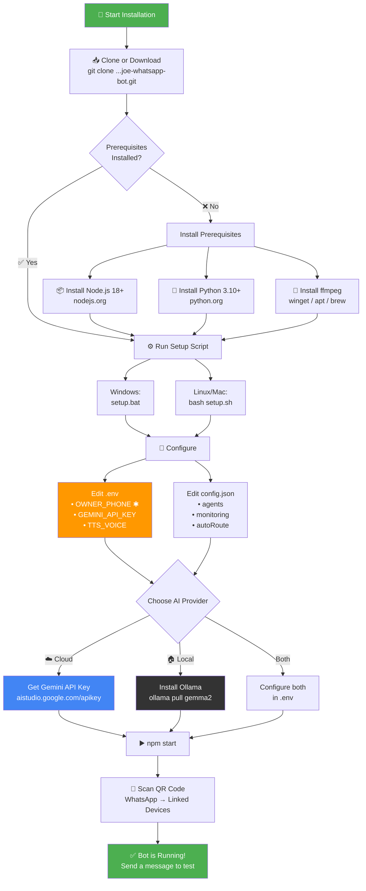
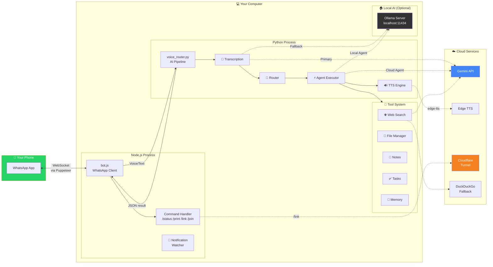
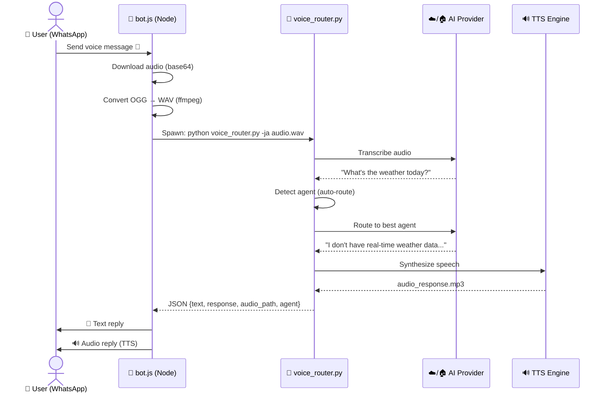
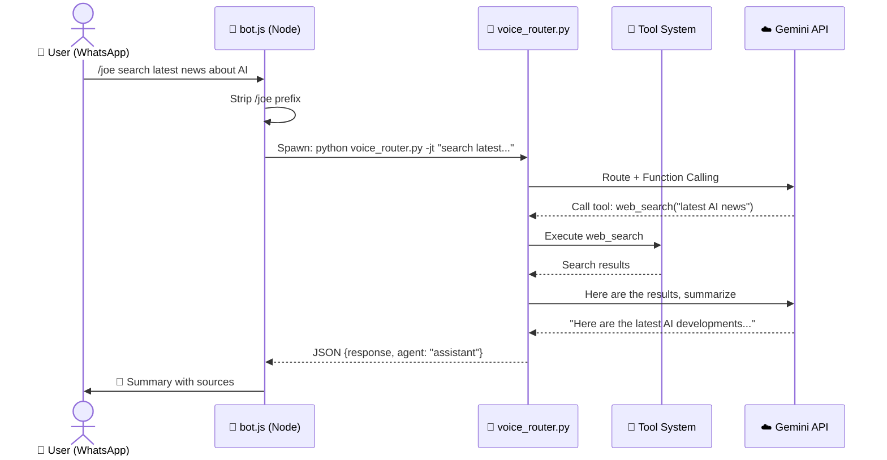
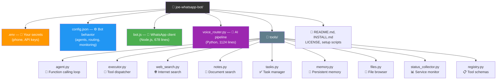
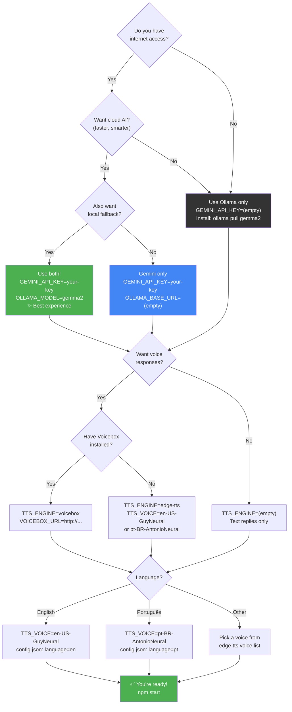

# 🗺️ Installation Map / Mapa de Instalação

> Visual guide to installing and understanding **joe-whatsapp-bot**.

---

## 1. Installation Flow / Fluxo de Instalação



---

## 2. Architecture Map / Mapa da Arquitetura



---

## 3. Message Flow / Fluxo de Mensagem





---

## 4. File Map / Mapa de Arquivos



---

## 5. Configuration Decision Tree / Árvore de Decisão de Configuração



---

## 6. Port & Service Map / Mapa de Portas e Serviços

| Port | Service | Required | Configured In |
|------|---------|----------|--------------|
| — | WhatsApp (WebSocket via Puppeteer) | ✅ Always | Automatic |
| 11434 | Ollama (local LLM) | If using local AI | `.env` → `OLLAMA_BASE_URL` |
| 17493 | Voicebox (TTS/STT) | If using Voicebox | `.env` → `VOICEBOX_URL` |
| 8080 | Tunnel target (your app) | If using `/link` | `.env` → `TUNNEL_PORT` |
| 9222 | Chrome DevTools (Puppeteer debug) | Never (internal) | Automatic |

---

## 7. Quick Reference Card / Cartão de Referência Rápida

```
┌─────────────────────────────────────────────────────┐
│                 joe-whatsapp-bot                     │
│              Quick Reference Card                    │
├─────────────────────────────────────────────────────┤
│                                                     │
│  INSTALL:                                           │
│    git clone → cd → setup.bat → edit .env → npm start │
│                                                     │
│  REQUIRED ENV:                                      │
│    OWNER_PHONE=5511999998888                        │
│                                                     │
│  COMMANDS:                                          │
│    /status     Check services                       │
│    /print      Screenshot a page                    │
│    /link       Create public tunnel                 │
│    /join URL   Join WhatsApp group                  │
│    /joe MSG    Talk to bot in groups                │
│    @agent MSG  Direct to specific agent             │
│                                                     │
│  FILES:                                             │
│    .env           → Secrets & keys                  │
│    config.json    → Bot behavior                    │
│    bot.js         → WhatsApp client                 │
│    voice_router.py→ AI pipeline                     │
│    tools/         → Extensible tools                │
│                                                     │
│  AI PROVIDERS:                                      │
│    Cloud: GEMINI_API_KEY=AIza...                    │
│    Local: ollama pull gemma2                        │
│                                                     │
│  VOICE (PT-BR): TTS_VOICE=pt-BR-AntonioNeural      │
│  VOICE (EN-US): TTS_VOICE=en-US-GuyNeural          │
│                                                     │
└─────────────────────────────────────────────────────┘
```
