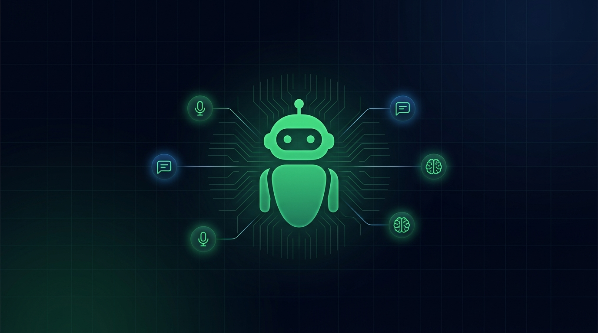
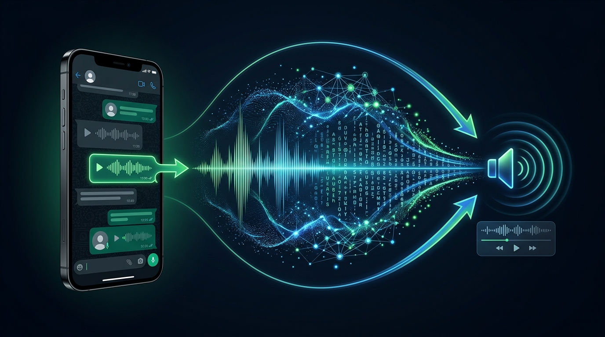
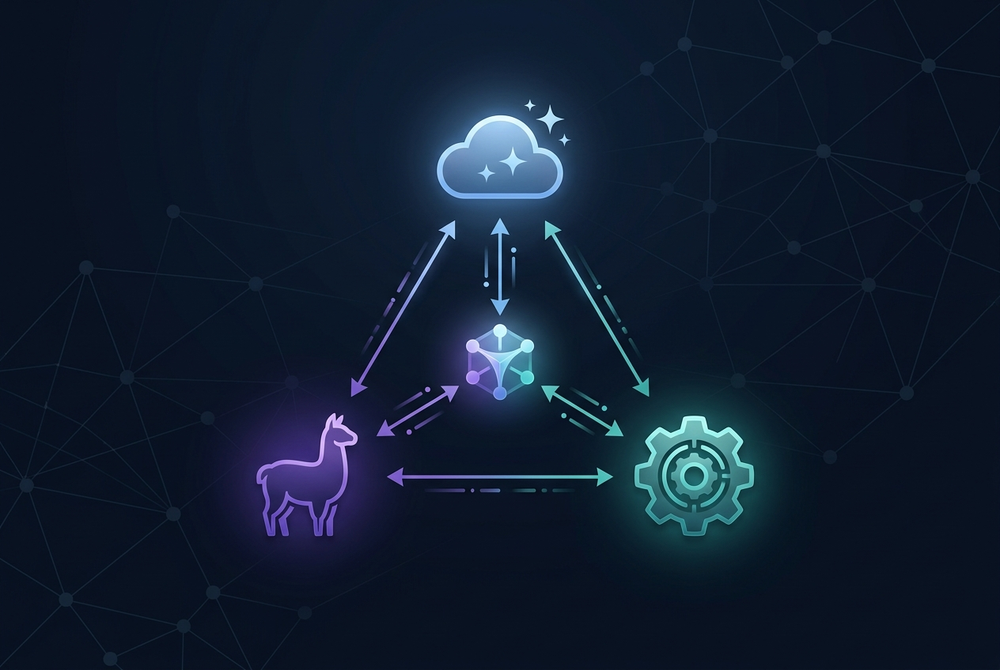
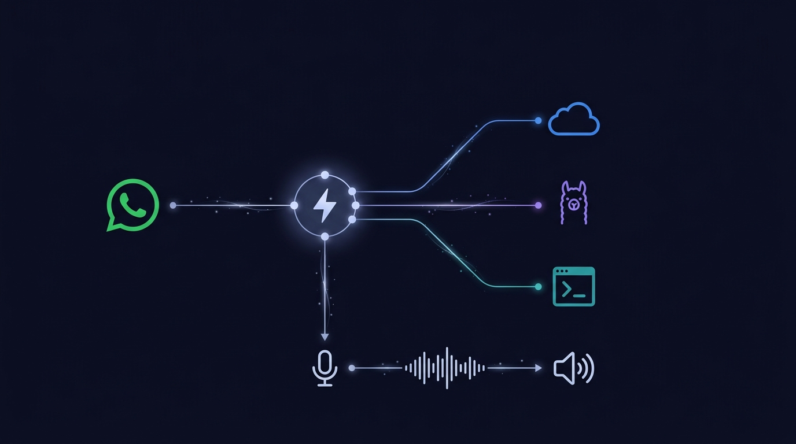
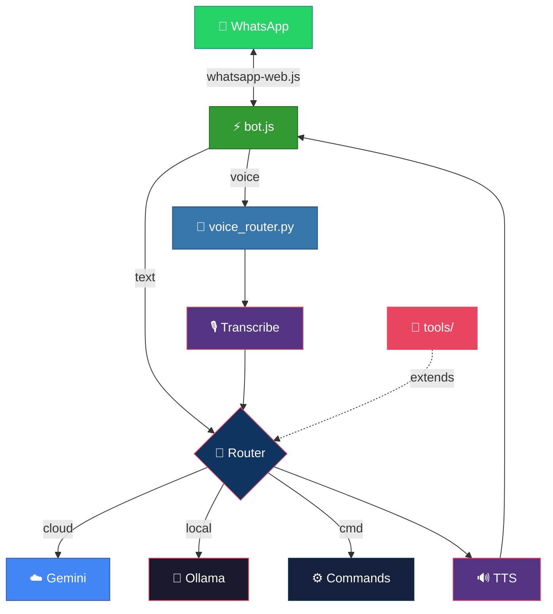
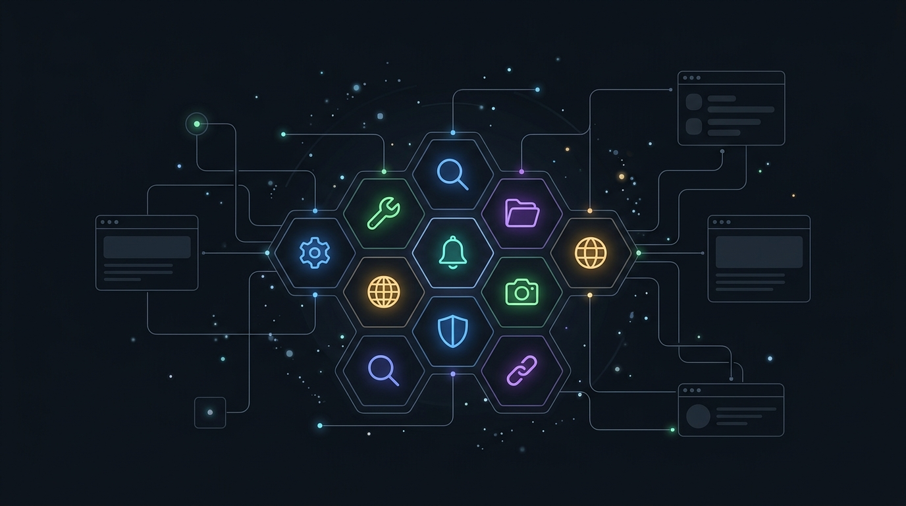

<div align="center">



<br><br>

# 🤖 Joe WhatsApp Bot

### Your personal AI butler on WhatsApp.

Voice & text. Cloud & local. Gemini & Ollama.<br>
Send a voice note, get an AI-powered voice reply. Ask anything, from anywhere.

<br>

[](LICENSE)
[](https://nodejs.org)
[](https://python.org)
[](#-quick-start)
[](https://aistudio.google.com/apikey)
[](https://ollama.ai)

<br>

[English](#-features) · [Português](#-funcionalidades) · [Install](INSTALL.md) · [Contributing](CONTRIBUTING.md)

</div>

<br>

---

<br>

## ✨ Features

<table>
<tr>
<td width="60">🎙️</td>
<td><strong>Voice conversations</strong> — Send a voice note → transcribed → AI processes → replies with TTS audio. Full voice loop.</td>
</tr>
<tr>
<td>💬</td>
<td><strong>Smart agent routing</strong> — Messages are routed to the best AI: Gemini for complex tasks, local Ollama for privacy-sensitive ones.</td>
</tr>
<tr>
<td>🧠</td>
<td><strong>Multi-agent system</strong> — Cloud AI (Gemini API) + Local AI (Ollama) working together. Switch with <code>@agent</code> or let auto-routing decide.</td>
</tr>
<tr>
<td>🔔</td>
<td><strong>Notification bridge</strong> — External apps push notifications through the bot to your WhatsApp. Perfect for server alerts and CI/CD.</td>
</tr>
<tr>
<td>🧰</td>
<td><strong>Extensible tool system</strong> — Drop a module in <code>tools/</code> and the AI gains new capabilities: web search, file management, notes, memory.</td>
</tr>
<tr>
<td>📸</td>
<td><strong>/print</strong> — Screenshot any webpage and receive it as an image in chat.</td>
</tr>
<tr>
<td>🌐</td>
<td><strong>/link</strong> — Spin up a temporary public URL via Cloudflare Tunnel, right from WhatsApp.</td>
</tr>
<tr>
<td>⚙️</td>
<td><strong>/status</strong> — Health-check your local services (Ollama, APIs, tunnels) without leaving the chat.</td>
</tr>
<tr>
<td>🖥️</td>
<td><strong>Cross-platform</strong> — Windows, Linux, macOS. One codebase, zero platform-specific hacks.</td>
</tr>
</table>

<br>

## 🎙️ Voice Conversation Flow

<div align="center">

</div>

<br>

Send a voice note in any chat. Joe transcribes it (Whisper or Gemini), routes the text to the best AI agent, generates a response, converts it to speech via Edge-TTS, and sends the audio reply back — all in a single seamless flow.

<br>

## 🧠 Multi-Agent System

<div align="center">

</div>

<br>

Joe doesn't lock you into a single AI. It runs a **smart routing layer** that dispatches messages to the right agent based on keywords, explicit `@agent` mentions, or auto-detection:

| Agent | Backend | Best for |
|:------|:--------|:---------|
| `assistant` | ☁️ Gemini API | Complex reasoning, coding, long context |
| `local` | 🦙 Ollama | Privacy-sensitive queries, offline use |
| `system` | ⚙️ Built-in | Bot commands (`/status`, `/print`, `/link`) |

Switch agents mid-conversation with `@gemini`, `@ollama`, or let the auto-router decide.

<br>

## 🏗️ Architecture

<div align="center">

</div>

<br>



**Node.js** handles the WhatsApp connection and message routing. **Python** handles the heavy lifting — voice transcription, AI inference, and text-to-speech. They communicate via subprocess stdio, keeping the architecture simple and the dependencies separated.

<br>

## 🚀 Quick Start

> **Prerequisites:** Node.js 18+, Python 3.10+, ffmpeg, and at least one AI backend (Gemini API key or local Ollama).

```bash
# 1. Clone
git clone https://github.com/RodDu/joe-whatsapp-bot.git
cd joe-whatsapp-bot

# 2. Install (pick your OS)
# Windows:
setup.bat
# Linux/macOS:
bash setup.sh

# 3. Configure
cp .env.example .env          # Fill in your values
cp config.example.json config.json

# 4. Launch
npm start
```

Scan the QR code in your terminal with **WhatsApp → Linked Devices → Link a Device**.

Send yourself a message to test. In groups, prefix with `/joe`.

> 📖 For detailed installation with troubleshooting, see **[INSTALL.md](INSTALL.md)**.

<br>

## 📋 Commands

<div align="center">

| Command | What it does |
|:--------|:-------------|
| `/joe [message]` | Talk to the bot in group chats |
| `@agent [message]` | Route to a specific agent — `@gemini`, `@ollama`, etc. |
| `/status` | Health-check local services |
| `/print [url]` | Screenshot a webpage → image in chat |
| `/link` | Create a public Cloudflare Tunnel URL |
| `/join [invite-link]` | Auto-join a WhatsApp group |
| *voice note* | Transcribe → AI → voice reply (automatic) |

</div>

<br>

## ⚙️ Configuration

The bot uses two config files:

<details>
<summary><strong><code>.env</code> — Secrets & Environment</strong></summary>

<br>

| Variable | Required | Description |
|:---------|:--------:|:------------|
| `OWNER_PHONE` | ✅ | Your WhatsApp number with country code, no `+` or spaces (e.g. `5511999998888`) |
| `GEMINI_API_KEY` | ⚡ | Free at [Google AI Studio](https://aistudio.google.com/apikey) |
| `OLLAMA_BASE_URL` | ⚡ | Default: `http://localhost:11434` |
| `OLLAMA_MODEL` | | Default: `gemma2` |
| `BOT_NAME` | | How the bot identifies itself |
| `USER_TITLE` | | How the bot addresses you |
| `BOT_SYSTEM_PROMPT` | | Custom system prompt for the AI |
| `TTS_ENGINE` | | `edge-tts` (default) or `voicebox` |
| `TTS_VOICE` | | Voice ID for TTS |
| `TRANSCRIPTION_ENGINE` | | `gemini`, `voicebox`, or `whisper` |
| `TUNNEL_PORT` | | Port for `/link` command |

⚡ = At least one AI backend required.

</details>

<details>
<summary><strong><code>config.json</code> — Bot Logic</strong></summary>

<br>

| Section | What it controls |
|:--------|:-----------------|
| `bot` | Bot name, language, general settings |
| `agents` | AI model definitions — `assistant` (Gemini), `local` (Ollama), `system` (commands) |
| `agentAliases` | Shortcuts like `@gemini` → routes to `assistant` agent |
| `autoRoute` | Keywords that auto-select the right agent |
| `monitoring` | Services to check with `/status` |
| `tts` | Character limits, voice selection |
| `notifications` | External notification watcher config |

</details>

<br>

## 🧰 Extending with Tools

<div align="center">

</div>

<br>

The tool system is modular. Add new capabilities without touching the core:

```
tools/
├── your_tool.js      # Define schema + execution logic
└── ...
```

1. Create a module in `tools/`
2. Define the tool schema and handler
3. Register it in the agent config

The AI will automatically call your tool when it decides it needs to, and use the returned data in its reply.

<br>

## 🗂️ Project Structure

```
joe-whatsapp-bot/
├── bot.js                  # Main process — WhatsApp connection & routing
├── voice_router.py         # Python — transcription, AI, TTS
├── config.example.json     # Bot logic config template
├── .env.example            # Environment variables template
├── package.json            # Node.js dependencies
├── requirements.txt        # Python dependencies
├── setup.bat / setup.sh    # One-click install scripts
├── install.bat / install.sh# Advanced installer with dependency checks
├── tools/                  # Extensible tool modules
├── INSTALL.md              # Detailed installation guide
├── INSTALL_MAP.md          # Installation dependency map
├── CONTRIBUTING.md         # Contribution guidelines
├── CODE_OF_CONDUCT.md      # Community standards
└── SECURITY.md             # Security policy
```

<br>

## 🔧 Troubleshooting

<details>
<summary><strong>No QR code appears</strong></summary>

Ensure `npm install` completed without errors and Puppeteer was installed. Check your internet connection. Try deleting `node_modules` and running `npm install` again.
</details>

<details>
<summary><strong>Node/Python errors on startup</strong></summary>

Verify: `node --version` (need 18+) and `python --version` (need 3.10+). On some systems, use `python3` instead of `python`.
</details>

<details>
<summary><strong>FFmpeg not found</strong></summary>

Install FFmpeg and add it to your system PATH. On Windows: `winget install ffmpeg`. On macOS: `brew install ffmpeg`. On Ubuntu: `sudo apt install ffmpeg`.
</details>

<details>
<summary><strong>Bot ignores my messages</strong></summary>

Check that `OWNER_PHONE` in `.env` matches your WhatsApp number exactly — with country code, no `+`, no spaces, no dashes.
</details>

<details>
<summary><strong>Voice messages fail</strong></summary>

Verify your `TRANSCRIPTION_ENGINE` setting. If using `gemini`, ensure your API key is valid. If using `whisper`, ensure the model is downloaded.
</details>

<br>

---

<br>

<div align="center">


<br><br>

# 🤖 Joe WhatsApp Bot

### Seu mordomo pessoal de IA no WhatsApp.

Voz & texto. Nuvem & local. Gemini & Ollama.<br>
Envie um áudio, receba uma resposta de IA por voz. Pergunte qualquer coisa, de qualquer lugar.

</div>

<br>

## ✨ Funcionalidades

<table>
<tr>
<td width="60">🎙️</td>
<td><strong>Conversas por voz</strong> — Envie um áudio → transcrição → IA processa → responde com áudio TTS. Loop de voz completo.</td>
</tr>
<tr>
<td>💬</td>
<td><strong>Roteamento inteligente</strong> — Mensagens são direcionadas para a melhor IA: Gemini para tarefas complexas, Ollama local para privacidade.</td>
</tr>
<tr>
<td>🧠</td>
<td><strong>Sistema multi-agentes</strong> — IA na nuvem (Gemini API) + IA local (Ollama) trabalhando juntas. Troque com <code>@agente</code> ou deixe o roteamento decidir.</td>
</tr>
<tr>
<td>🔔</td>
<td><strong>Ponte de notificações</strong> — Apps externos enviam notificações pelo bot direto no seu WhatsApp. Perfeito para alertas de servidor.</td>
</tr>
<tr>
<td>🧰</td>
<td><strong>Ferramentas extensíveis</strong> — Coloque um módulo em <code>tools/</code> e a IA ganha novas capacidades: pesquisa web, arquivos, notas, memória.</td>
</tr>
<tr>
<td>📸</td>
<td><strong>/print</strong> — Capture a tela de qualquer página web e receba como imagem no chat.</td>
</tr>
<tr>
<td>🌐</td>
<td><strong>/link</strong> — Crie uma URL pública temporária via Cloudflare Tunnel, direto do WhatsApp.</td>
</tr>
<tr>
<td>⚙️</td>
<td><strong>/status</strong> — Verifique a saúde dos serviços locais sem sair do chat.</td>
</tr>
<tr>
<td>🖥️</td>
<td><strong>Multiplataforma</strong> — Windows, Linux, macOS. Um código, zero gambiarras.</td>
</tr>
</table>

<br>

## 🎙️ Fluxo de Conversação por Voz

<div align="center">

</div>

<br>

Envie um áudio em qualquer chat. O Joe transcreve (Whisper ou Gemini), roteia o texto para o melhor agente de IA, gera uma resposta, converte para fala via Edge-TTS e envia o áudio de volta — tudo em um fluxo contínuo.

<br>

## 🧠 Sistema Multi-Agentes

<div align="center">

</div>

<br>

O Joe não te prende a uma única IA. Ele roda uma **camada de roteamento inteligente** que despacha mensagens para o agente certo:

| Agente | Backend | Melhor para |
|:-------|:--------|:------------|
| `assistant` | ☁️ Gemini API | Raciocínio complexo, código, contexto longo |
| `local` | 🦙 Ollama | Queries sensíveis, uso offline |
| `system` | ⚙️ Built-in | Comandos do bot (`/status`, `/print`, `/link`) |

Troque de agente com `@gemini`, `@ollama`, ou deixe o roteador automático decidir.

<br>

## 🚀 Início Rápido

> **Pré-requisitos:** Node.js 18+, Python 3.10+, ffmpeg e pelo menos um backend de IA (chave Gemini API ou Ollama local).

```bash
# 1. Clone
git clone https://github.com/RodDu/joe-whatsapp-bot.git
cd joe-whatsapp-bot

# 2. Instale (escolha seu SO)
# Windows:
setup.bat
# Linux/macOS:
bash setup.sh

# 3. Configure
cp .env.example .env          # Preencha seus valores
cp config.example.json config.json

# 4. Inicie
npm start
```

Escaneie o QR code no terminal com **WhatsApp → Aparelhos Conectados → Conectar Aparelho**.

Envie uma mensagem para si mesmo para testar. Em grupos, use o prefixo `/joe`.

> 📖 Para instalação detalhada, veja **[INSTALL.md](INSTALL.md)**.

<br>

## 📋 Comandos

<div align="center">

| Comando | O que faz |
|:--------|:----------|
| `/joe [mensagem]` | Fala com o bot em grupos |
| `@agente [mensagem]` | Roteia para um agente específico — `@gemini`, `@ollama`, etc. |
| `/status` | Verifica a saúde dos serviços locais |
| `/print [url]` | Captura de tela de uma página → imagem no chat |
| `/link` | Cria uma URL pública via Cloudflare Tunnel |
| `/join [link-convite]` | Entra automaticamente em um grupo do WhatsApp |
| *áudio de voz* | Transcreve → IA → resposta em áudio (automático) |

</div>

<br>

## ⚙️ Configuração

<details>
<summary><strong><code>.env</code> — Segredos e Ambiente</strong></summary>

<br>

| Variável | Obrigatório | Descrição |
|:---------|:--------:|:----------|
| `OWNER_PHONE` | ✅ | Seu número WhatsApp com código do país, sem `+` ou espaços (ex: `5511999998888`) |
| `GEMINI_API_KEY` | ⚡ | Gratuita no [Google AI Studio](https://aistudio.google.com/apikey) |
| `OLLAMA_BASE_URL` | ⚡ | Padrão: `http://localhost:11434` |
| `OLLAMA_MODEL` | | Padrão: `gemma2` |
| `BOT_NAME` | | Como o bot se identifica |
| `USER_TITLE` | | Como o bot te chama |
| `BOT_SYSTEM_PROMPT` | | Prompt de sistema personalizado |
| `TTS_ENGINE` | | `edge-tts` (padrão) ou `voicebox` |
| `TRANSCRIPTION_ENGINE` | | `gemini`, `voicebox` ou `whisper` |

⚡ = Pelo menos um backend de IA é necessário.

</details>

<details>
<summary><strong><code>config.json</code> — Lógica do Bot</strong></summary>

<br>

| Seção | O que controla |
|:------|:---------------|
| `bot` | Nome, idioma, configurações gerais |
| `agents` | Modelos de IA — `assistant` (Gemini), `local` (Ollama), `system` (comandos) |
| `agentAliases` | Atalhos como `@gemini` → roteia para o agente `assistant` |
| `autoRoute` | Palavras-chave que selecionam o agente automaticamente |
| `monitoring` | Serviços verificados pelo `/status` |
| `tts` | Limites de caracteres, seleção de voz |
| `notifications` | Configuração do observador de notificações |

</details>

<br>

## 🧰 Estendendo com Ferramentas

<div align="center">

</div>

<br>

O sistema de ferramentas é modular. Adicione novas capacidades sem tocar no core:

```
tools/
├── sua_ferramenta.js   # Defina schema + lógica de execução
└── ...
```

1. Crie um módulo em `tools/`
2. Defina o schema e o handler da ferramenta
3. Registre na configuração do agente

A IA chamará sua ferramenta automaticamente quando decidir que precisa, e usará os dados retornados na resposta.

<br>

## 🔧 Solução de Problemas

<details>
<summary><strong>QR code não aparece</strong></summary>

Confirme que o `npm install` terminou sem erros. Tente deletar `node_modules` e rodar `npm install` novamente.
</details>

<details>
<summary><strong>Erros de Node/Python ao iniciar</strong></summary>

Verifique: `node --version` (precisa 18+) e `python --version` (precisa 3.10+). Em alguns sistemas, use `python3`.
</details>

<details>
<summary><strong>FFmpeg não encontrado</strong></summary>

Instale o FFmpeg e adicione ao PATH. Windows: `winget install ffmpeg`. macOS: `brew install ffmpeg`. Ubuntu: `sudo apt install ffmpeg`.
</details>

<details>
<summary><strong>Bot ignora minhas mensagens</strong></summary>

Verifique se o `OWNER_PHONE` no `.env` corresponde ao seu número exatamente — com código do país, sem `+`, sem espaços.
</details>

<details>
<summary><strong>Mensagens de voz falham</strong></summary>

Verifique a configuração de `TRANSCRIPTION_ENGINE`. Se usar `gemini`, garanta que a chave API é válida.
</details>

<br>

---

<br>

<div align="center">

## ⚠️ Disclaimer

This bot uses [whatsapp-web.js](https://github.com/pedroslopez/whatsapp-web.js), an unofficial WhatsApp API.<br>
Use at your own risk. For personal use only. Do not use for spam or unauthorized messaging.

<br>

[](LICENSE)
[](CODE_OF_CONDUCT.md)
[](SECURITY.md)

<br>

**[⬆ Back to top](#-joe-whatsapp-bot)**

</div>
